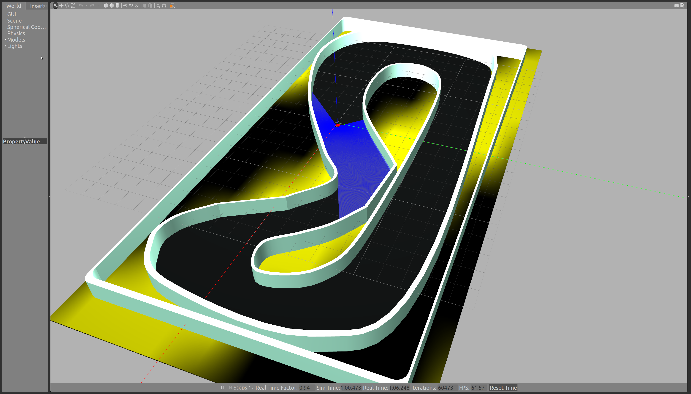

# The FLASH Van 
The team name stands for **F**u**l**ly **A**utonomous but **S**tuff **H**appens and we are from **Van**derbilt.
Team members are:
* Patrick Musau (Project Leader)
* Feiyang Cai
* Tim Darrah
* Nathaniel (Nate) Hamilton
* Diego Manzanas Lopez
* Shreyas Ramakrishna
* Ayana Wild

# Vehicle Configuration
Our car is modeled after the V2 using a Hokuyo UST-10LX lidar and ZED Camera for sensing and localization, with a NVIDIA TX2 for processing.

# Repository Organization
**racecar-ws**: Code deployed on the physical car


# How to Build the Code
The particle filter used for localization depends on [RangeLibc](https://github.com/kctess5/range_libc). Run the following to install the python wrappers for range_libc:

```cd range_libc/pywrappers```

##### on VM

```./compile.sh```

##### on car - compiles GPU ray casting methods

```./compile_with_cuda.sh ```

# F1Tenth Simulation
The simulation packages in this repository contain code to run a car autonomously on a race track/circuit. The simulator was built using [ROS](http://wiki.ros.org/) and [Gazebo](http://gazebosim.org/tutorials). There are several race tracks available for testing and they are contained in racecar_gazebo/worlds directory. However, the majority of our testing utilized the following .world files:
  1. track_barca.world
  2. track_porto.world
  3. track_levine.world
 
To launch the simulation run the following roslaunch command:
```roslaunch race f1tenth.launch```

This will start Gazebo and ROS. A window will pop showing a racecar in a track with all of the relevant sensors running. 



#### Run particle filter:
```roslaunch particle_filter localize.launch```
#### Run pure pursuit
```roslaunch a_stars_pure_pursuit pure_pursuit_sim.launch  ```

#### Hallway simulation using teb planner, amcl, map built from gmapping:

```roslaunch wall_following move_base.launch```
